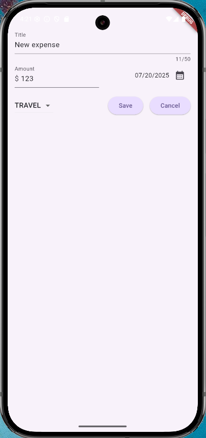

# Flutter Expense Tracker

## Description

This is my second application developed in **Flutter** and **Dart.**

This is a simple mobile application for expense tracking that deeps dive more on advanced concepts like interactivity with additional widgets for managing content and theming. The application also includes a custom widget for displaying a chart of expenses by categories.

## User Story

```
As a financially responsible software developer
I want to track my expenses by categories
So that I can plan and achieve my long-term financial goals
```

## Design

```
--\lib\models\expense.dart:

Contains an object consisting of the predefined attributes that comprise an expense record; for simplicity, that is a title, amount, date, and category. The category is one of a predefined list (food, travel, leisure, work).
```


```
--\lib\widgets\expenses.dart:

Main screen. Manages the state of the application, including switching between screens:
```

### Main Screen


### Add New Expense



### Remove Expense


## License

This project is licensed under The MIT License. Refer to https://opensource.org/licenses/MIT for more information of what you can and cannot do with this project. See contact information below if you have questions, comments, or suggestions for the project.

## Contributing Guidelines

Want to contribute to this project? You may clone or fork the project in GitHub. Note the licesing information referred in this file.

## License

This application is licensed under the following license:

[](https://opensource.org/licenses/MIT)(https://opensource.org/licenses/MIT)
